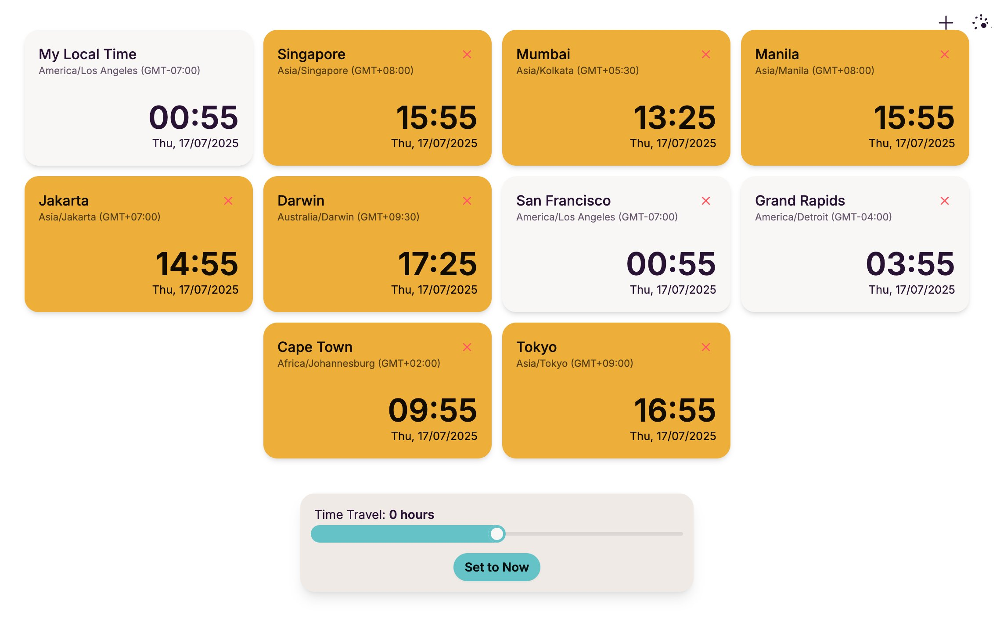

# Team Timezone Wall

A simple, elegant, and customizable web-based clock wall designed to help distributed teams keep track of different timezones at a glance.

## Features

*   **Multiple Clocks**: Display clocks for various timezones simultaneously.
*   **Auto-Detect Local Time**: Includes a "My Local Time" clock that automatically detects and displays the user's current timezone.
*   **Customizable Dashboard**: Easily add or remove clocks for any timezone to create a personalized dashboard.
*   **Time-Travel Slider**: A unique slider allows you to shift time forward or backward to effortlessly check future or past times across all displayed clocks. This is perfect for scheduling meetings.
*   **Working Hours Indicator**: Clocks within standard working hours (8 AM - 6 PM) are highlighted with an accent color, making it easy to see who is likely to be online.
*   **Theme Support**: Switch between a clean light theme and a sleek dark theme to suit your preference.
*   **Persistent Configuration**: Your custom set of clocks is automatically saved in your browser's local storage, so your setup is preserved between visits.
*   **Responsive Design**: The layout is fully responsive and works beautifully on both desktop and mobile devices.

## How to Use

1.  **Open the file**: Simply open the `index.html` file in any modern web browser.
2.  **Add Clocks**: Click the **+** button in the top-right corner to open the "Add New Clock" dialog. Select a timezone and optionally give it a custom name.
3.  **Remove Clocks**: Click the **×** button on any clock card (except for your local time) to remove it from the dashboard.
4.  **Toggle Theme**: Use the sun/moon icon in the top-right to switch between light and dark modes.
5.  **Time Travel**: Use the slider at the bottom of the page to scrub through time. Click the "Set to Now" button to reset all clocks to the current time.

## Technologies Used

*   **HTML5**
*   **CSS3** with [Tailwind CSS](https://tailwindcss.com/) and [DaisyUI](https://daisyui.com/) for styling and components.
*   **Vanilla JavaScript** for all functionality, with no external libraries or frameworks.
